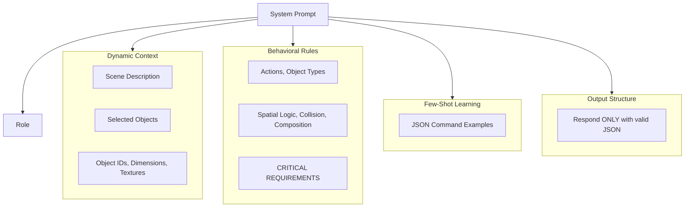
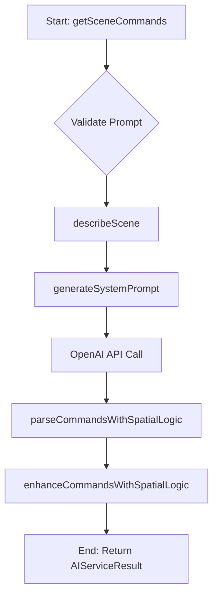
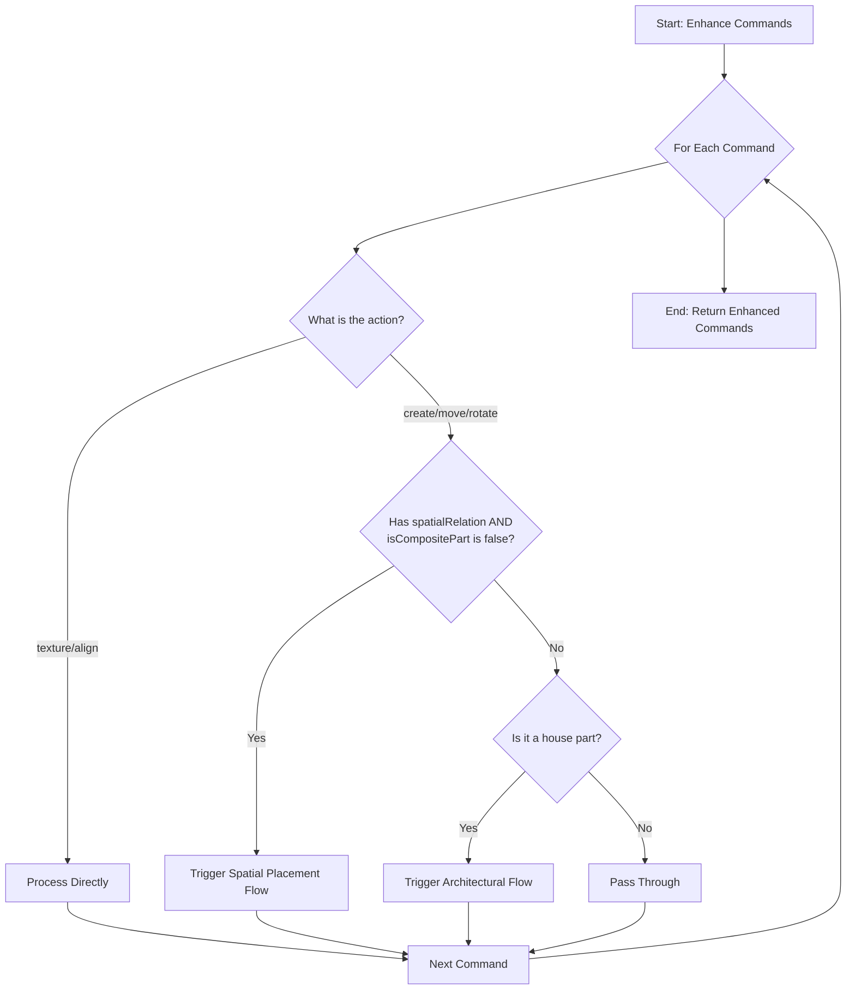

import { Callout } from 'nextra/components'

# AI Service Documentation

## Overview

The `AIService` class is the central hub for interpreting natural language user prompts and translating them into a series of actionable commands to modify the 3D scene. It leverages the OpenAI API (`gpt-4o`) combined with a sophisticated layer of internal spatial and architectural logic to ensure precise and intelligent scene manipulation.

The service's primary responsibilities include:
- Generating a dynamic, context-rich system prompt for the AI.
- Processing user text to generate `SceneCommand` objects.
- Enhancing AI-generated commands with precise positioning, scaling, and collision avoidance logic.
- Managing special logic for architectural elements (e.g., roofs, walls) and composite objects.

---
## Prompt Engineering Architecture

The behavior of the AI is almost entirely controlled by the master prompt created in the `generateSystemPrompt` function. This prompt is dynamically assembled on every API call and is constructed from several key building blocks designed to give the AI context, rules, and clear output requirements.

### 1. Dynamic Context Injection
-   **Scene Description**: A detailed text summary of every object, its properties (position, scale, color), and its relationships is generated by `describeScene()` and placed at the top of the prompt.
-   **Selection State**: The prompt explicitly states which object(s) are currently selected.
-   **Available Assets**: The lists of available object types, GLB models, and textures are included so the AI knows what it can create or apply.

### 2. Capability and Rule Definition
-   **Available Actions**: A simple, numbered list of all valid actions (`move`, `create`, etc.).
-   **Behavioral Sections**: Explicit sections like `COLLISION AVOIDANCE`, `OBJECT COMPOSITION`, and `POSITIONING PRECISION` define how the AI should handle complex scenarios.
-   **Critical Requirements**: A final, high-priority list of rules that summarizes the most important instructions to reinforce them.

### 3. Example-Based Learning (Few-Shot Prompting)
The prompt includes numerous `... COMMAND EXAMPLES` sections that provide concrete examples of a user's request and the exact JSON command to be generated. This is a highly effective technique for guiding the AI's output format.

---
## Key Functions & Detailed Flows

This section provides a deeper breakdown of each major function within the `AIService`.

### `getSceneCommands()`
This is the main public entry point for the service. It orchestrates the entire process of converting a raw user prompt into a finalized list of `SceneCommand` objects.

- **Purpose**: To manage the end-to-end flow of prompt processing.
- **Inputs**: `prompt` (string), `sceneObjects` (array), `selectedObjectId` (string), `selectedObjectIds` (array).
- **Output**: An `AIServiceResult` object containing the final commands or an error.

### `describeScene()`
This function serializes the current state of the 3D world into a detailed text description for the AI to use as context. A rich and accurate description is critical for the AI to make informed decisions.

- **Purpose**: To translate the application's object-oriented scene state into a format the AI can understand.
- **Logic**:
    1.  Filters scene objects into categories (ground, primitives, housing, custom rooms).
    2.  For each object, it formats a string containing its type, name/ID, color, position, rotation, and dimensions (calculated via `getObjectDimensions`).
    3.  For `custom-room` objects, it includes special metadata like the coordinates of the floor's corners to give the AI detailed architectural context.
    4.  Concatenates all these pieces into a single, comprehensive description string.

### `generateSystemPrompt()`
This is the most critical function for controlling the AI's behavior. It dynamically constructs the master set of instructions, rules, and examples that are sent to the AI with every request.

- **Purpose**: To engineer the perfect prompt to constrain and guide the AI's output.
- **Logic**:
    1.  Starts with a base template that defines the AI's persona ("You are a 3D scene assistant...").
    2.  Injects all the dynamic context: the output from `describeScene()`, the current object selection, a list of available GLB models and textures, and the static `baseDimensions` of all known object types.
    3.  Appends all the behavioral rule sections (`POSITIONING PRECISION`, `COLLISION AVOIDANCE`, `OBJECT COMPOSITION`, etc.).
    4.  Appends the many `... COMMAND EXAMPLES` to provide few-shot learning for correct JSON formatting and command usage.
    5.  Concludes with the high-priority `CRITICAL REQUIREMENTS` list and a final, strict instruction to only respond with valid JSON.

### `enhanceCommandsWithSpatialLogic()`
This function acts as a deterministic "correction layer" on top of the AI's output. It intercepts the commands from the AI and applies precise calculations to ensure accuracy, especially for spatial commands where the AI's output might be ambiguous or imprecise.

- **Purpose**: To enforce precision and handle complex spatial relationships that are easier to calculate with code than to describe to an AI.
- **Logic**: It iterates through the AI-generated commands and decides whether to pass them through, modify them, or replace them based on the rules. Its most important job is to trigger `calculatePreciseSpatialPlacement` for spatial commands that are not marked as composite parts.

### `calculatePreciseSpatialPlacement()`
This is the core of the service's "smart" positioning logic. It calculates the exact coordinates needed to place an object in relation to another one (e.g., "on top of").

- **Purpose**: To translate a relative spatial term into an absolute, precise `(x, y, z)` position.
- **Logic**:
    1.  Gets the dimensions and bounding boxes for both the moving object and the reference object.
    2.  Calls `shouldMatchDimensions` to check if the moving object's footprint should be scaled to match the reference object (e.g., a roof on a room).
    3.  If scaling is needed, it calls `calculateDimensionMatchingScale`.
    4.  It then calls `calculatePreciseContactPosition` with the final dimensions to get the exact coordinates for perfect surface-to-surface contact.
    5.  Returns the calculated position and any new scale factors.
