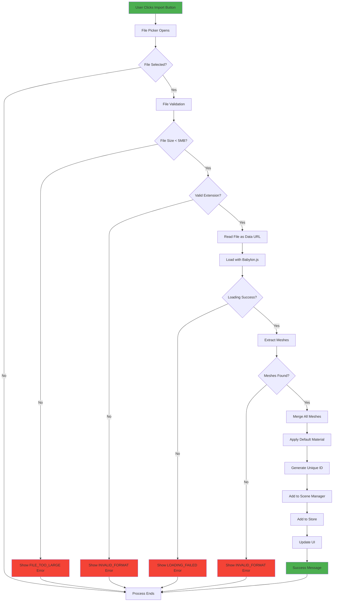
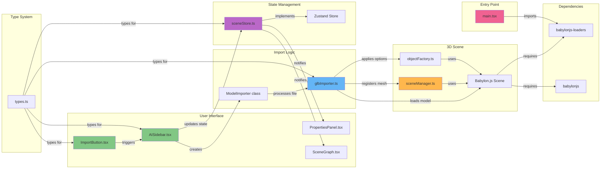

# 3D Model Import Process Documentation

## Overview
The vibeCAD application supports importing 3D models in GLB, STL, and OBJ formats. The import process is designed to handle files up to 5MB, convert them to a unified format, and integrate them seamlessly into the scene.

## Supported Formats
- **GLB** (Binary GLTF) - Optimized 3D models with embedded textures and materials
- **STL** (Stereolithography) - Common format for 3D printing, geometry only
- **OBJ** (Wavefront) - Widely supported format with material support

## File Size Limit
- Maximum: 5MB (5 * 1024 * 1024 bytes)

## Import Process Flow

## Key Files and Their Roles

### 1. **UI Components**

#### `/src/components/sidebar/ImportButton.tsx`
- **Purpose**: Provides the UI button and file input handling
- **Key Functions**:
  - `handleClick()`: Triggers the hidden file input
  - `handleFileSelect()`: Handles file selection and calls the import callback
- **Features**:
  - Shows loading state during import
  - Displays local error messages
  - Accepts `.glb`, `.stl`, `.obj` files

#### `/src/components/sidebar/AISidebar.tsx`
- **Purpose**: Contains the import button and manages the import flow
- **Key Functions**:
  - `handleImportGLB()`: Main import orchestrator
- **Responsibilities**:
  - Creates the ModelImporter instance
  - Manages import state (loading, errors)
  - Adds imported object to scene store
  - Updates response log

### 2. **Import Logic**

#### `/src/babylon/glbImporter.ts`
- **Purpose**: Core import logic and 3D model processing
- **Classes**:
  - `ModelImporter`: Main class handling the import process
- **Key Methods**:
  - `importModel()`: Main entry point for importing
  - `getFileExtension()`: Validates and extracts file extension
  - `mergeMeshes()`: Combines multiple meshes into one
  - `applyDefaultMaterial()`: Strips materials and applies gray material
- **Process**:
  1. Validates file size (5MB limit)
  2. Reads file as base64 data URL
  3. Uses Babylon.js SceneLoader to parse the file
  4. Merges all meshes into a single mesh
  5. Applies default gray material
  6. Generates unique ID based on file type

### 3. **3D Scene Integration**

#### `/src/babylon/sceneManager.ts`
- **Purpose**: Manages the Babylon.js scene and meshes
- **Import-Related Features**:
  - Imports `babylonjs-loaders` to register file format loaders
  - `addMesh()`: Handles 'imported-glb', 'imported-stl', 'imported-obj' types
  - `addPreExistingMesh()`: Registers already-created meshes from imports

#### `/src/babylon/objectFactory.ts`
- **Purpose**: Factory for creating 3D objects
- **Import Integration**:
  - `integrateImportedMesh()`: Applies standard options to imported meshes
  - `createPrimitiveMesh()`: Routes imported types to error (they use different flow)

### 4. **State Management**

#### `/src/state/sceneStore.ts`
- **Purpose**: Global state management using Zustand
- **Import State**:
  - `isImporting`: Boolean flag for loading state
  - `importError`: Stores import error details
- **Import Actions**:
  - `startImport()`: Sets loading state
  - `importSuccess()`: Clears loading state
  - `setImportError()`: Sets error state
  - `clearImportError()`: Clears error state
  - `addObject()`: Adds imported object to scene

### 5. **Type Definitions**

#### `/src/types/types.ts`
- **Purpose**: TypeScript type definitions
- **Import Types**:
  - `PrimitiveType`: Includes 'imported-glb', 'imported-stl', 'imported-obj'
  - `ImportError`: Interface for import error structure
  - `ImportErrorType`: Union type for error types
  - `SceneObject`: Interface for all scene objects including imports

### 6. **Entry Point**

#### `/src/main.tsx`
- **Purpose**: Application entry point
- **Import Setup**:
  - Imports `babylonjs-loaders` at the very top
  - Ensures loaders are registered before any Babylon.js usage

### 7. **Styling**

#### `/src/App.css`
- **Purpose**: Application styles
- **Import Styles**:
  - `.import-button`: Button styling (green background)
  - `.import-error`: Error message styling
  - `.import-error-message`: Additional error display styling

## External Dependencies

### `/package.json`
- **babylonjs**: ^8.15.1 - Core 3D engine
- **babylonjs-loaders**: ^8.15.1 - File format loaders for GLB/STL/OBJ

## Import Process Detailed Steps

1. **User Interaction**
   - User clicks "Import 3D Model" button
   - File picker opens with filter for .glb, .stl, .obj files

2. **File Validation**
   - Check file size (must be < 5MB)
   - Validate file extension

3. **File Reading**
   - File is read as base64 data URL using FileReader API
   - This avoids blob URL issues with Babylon.js

4. **Babylon.js Loading**
   - SceneLoader.LoadAssetContainerAsync() parses the file
   - Appropriate loader (GLB/STL/OBJ) is automatically selected
   - All assets are added to the scene

5. **Mesh Processing**
   - Filter out non-mesh objects (cameras, lights, etc.)
   - Merge multiple meshes into single mesh using Mesh.MergeMeshes()
   - Reset transform to origin

6. **Material Processing**
   - Remove all existing materials
   - Apply uniform gray (#808080) StandardMaterial
   - Set material properties for proper rendering

7. **Scene Integration**
   - Generate unique ID: `imported-{type}-{timestamp}`
   - Register mesh with SceneManager
   - Apply standard object properties

8. **State Update**
   - Create SceneObject with proper type
   - Add to scene store
   - Update UI components

9. **User Feedback**
   - Show success message in response log
   - Clear loading state
   - Object appears in scene graph

## Error Handling

### Error Types
1. **FILE_TOO_LARGE**: File exceeds 5MB limit
2. **INVALID_FORMAT**: File format not recognized or no valid geometry
3. **LOADING_FAILED**: Generic loading error

### Error Display
- All errors show "IMPORT FAILED" message
- Errors are displayed below the import button
- Errors are logged to the AI response log

## Material Handling
- All imported materials are stripped
- Default gray color (#808080) is applied
- Users can change color after import using properties panel

## Unique Features
- Single mesh output regardless of input complexity
- Consistent naming convention across file types
- Integration with existing transform tools
- Full support for selection, manipulation, and AI commands

## File Relationship Diagram

## Summary

The import process in vibeCAD is a well-orchestrated flow that involves multiple layers:

1. **Presentation Layer**: UI components handle user interaction and display
2. **Business Logic Layer**: ModelImporter processes and validates files
3. **Integration Layer**: Scene management integrates models into Babylon.js
4. **State Layer**: Zustand store maintains application state
5. **Infrastructure Layer**: Babylon.js and its loaders handle the actual file parsing

This architecture ensures:
- Clean separation of concerns
- Robust error handling at each layer
- Consistent user experience
- Easy extensibility for new formats
