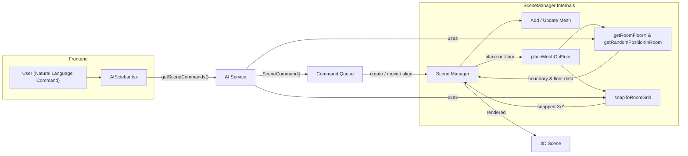

# AI Room Integration Implementation Guide

## Overview

This document explains the implementation of AI-powered room-aware object placement in VibeCAD. The system allows users to place objects inside custom rooms using natural language commands like "put a cube in the bedroom" with automatic floor positioning and grid snapping.

## Architecture Overview



The diagram above illustrates end-to-end flow:
1. **User → AISidebar**: Prompt is sent to AI Service.
2. **AI Service**: Generates SceneCommand array (e.g., `create`, `place-on-floor`).
3. **Command Queue**: AISidebar iterates and dispatches each command.
4. **Scene Manager** executes:
   • `create` → adds mesh.
   • `place-on-floor` → `placeMeshOnFloor`, which queries Boundary Utils for floor Y and calls `snapToRoomGrid` for X/Z alignment.
5. **Scene** updates and renders in real time.

---

### Core Principle: Separation of Concerns

The implementation follows the proven **align function pattern** where:
- **AI Service**: Generates commands, handles natural language processing
- **Scene Manager**: Executes positioning using actual mesh data
- **Boundary Utils**: Provides spatial detection and coordinate conversion utilities

## System Components

### 1. Custom Room System

**Room Creation**:
- Users draw room boundaries using a grid-based drawing tool
- Rooms are stored as `SceneObject` with `type: 'custom-room'`
- Each room contains:
  - `roomName`: User-defined name (e.g., "bedroom")
  - `gridInfo`: Grid configuration for floor snapping
  - `mesh.metadata.roomData`: Boundary polygon points

**Room Properties**:
```typescript
interface SceneObject {
  type: 'custom-room'
  roomName?: string
  gridInfo?: {
    gridSize: number        // Size of each grid cell
    worldScale: number      // Scale from drawing to world units
    drawingBounds?: { width: number; height: number }
  }
  mesh?: {
    metadata?: {
      roomData: {
        points: { x: number; y: number }[]  // Room boundary polygon
      }
    }
  }
}
```

### 2. AI Service Enhancement

**Natural Language Processing**:
- Detects spatial relationships: `inside`, `into`, `in the`, `within`
- Extracts room names from user commands
- Matches room names to actual room objects in scene

**Command Generation**:
```typescript
// User: "put a red cube in the bedroom"
// AI Service generates:
[
  { action: 'create', type: 'cube', color: '#ff6b6b' },
  { 
    action: 'place-on-floor', 
    objectId: 'generated-cube-id', 
    relativeToObject: 'bedroom',
    snapToGrid: true 
  }
]
```

### 3. The `place-on-floor` Action

**Command Structure**:
```typescript
interface SceneCommand {
  action: 'place-on-floor'
  objectId: string           // Object to position
  relativeToObject: string   // Target room name/ID
  snapToGrid?: boolean       // Enable grid snapping
}
```

**Processing Flow**:
1. AI Service generates `place-on-floor` command
2. Command passed through without position calculations
3. Scene Manager executes with access to actual mesh data

### 4. Room Boundary Detection

**Core Functions** (in `boundaryUtils.ts`):

```typescript
// Check if position is within room boundaries
isPositionInRoom(position: Vector3, room: SceneObject): boolean

// Find which room contains a position
findContainingRoom(position: Vector3, rooms: SceneObject[]): SceneObject | null

// Get room floor Y position
getRoomFloorY(room: SceneObject): number

// Get room center point
getRoomCenter(room: SceneObject): Vector3

// Generate random valid position within room
getRandomPositionInRoom(room: SceneObject): Vector3
```

**Coordinate Conversion**:
- `worldToDrawingCoordinates()`: World space → Drawing coordinates
- `drawingToWorldCoordinates()`: Drawing coordinates → World space
- `isPointInPolygon()`: Point-in-polygon detection using ray casting

## Command Flow: End-to-End

### Example: "put a red cube in the bedroom"

**Step 1: Natural Language Processing**
```typescript
// extractSpatialContext() detects:
{
  spatialRelationDetected: true,
  relation: 'inside',
  referenceObject: bedroomRoomObject,
  description: 'Reference room: "bedroom" room...'
}
```

**Step 2: Command Generation**
```typescript
// enhanceCommandsWithSpatialLogic() generates:
[
  {
    action: 'create',
    type: 'cube', 
    color: '#ff6b6b'
  },
  {
    action: 'place-on-floor',
    objectId: 'cube-xyz', 
    relativeToObject: 'bedroom',
    snapToGrid: true
  }
]
```

**Step 3: Scene Manager Execution** (Implementation Required)
```typescript
// Scene Manager processes place-on-floor:
1. Find target room mesh by name/ID
2. Get room's actual bounding box and floor Y position
3. Calculate valid position within room boundaries
4. Apply grid snapping using room's gridInfo
5. Position object with bottom touching floor
```

## Technical Implementation Details

### 1. Room Detection Logic

**findObjectByDescription() Enhancement**:
```typescript
// Prioritizes room name matching for 'inside' relationships
if (detectedRelation === 'inside' && roomNameMatches) {
  const roomName = extractRoomName(roomMatch);
  referenceObject = this.findObjectByDescription(roomName, sceneObjects);
}
```

**Room Name Patterns**:
- Regex: `/(?:in|into|inside)\s+(?:the\s+)?([a-zA-Z0-9\s]+?)(?:\s+room|\s|$)/g`
- Matches: "in the bedroom", "into kitchen", "inside living room"

### 2. Spatial Relationship Processing

**Room vs Non-Room Handling**:
```typescript
if (referenceObject.type === 'custom-room' && command.spatialRelation === 'inside') {
  // Generate place-on-floor command for rooms
  generatePlaceOnFloorCommand();
} else {
  // Use existing spatial placement logic for other objects
  calculatePreciseSpatialPlacement();
}
```

### 3. Grid Snapping Integration

**Room Grid Configuration**:
- `gridSize`: Size of each grid cell in drawing units
- `worldScale`: Conversion factor (drawing units → world units)
- Grid snapping handled by Scene Manager using `snapToRoomGrid()`

**Grid Coordinate System**:
- Drawing coordinates: Original SVG canvas space (400×400 pixels)
- World coordinates: 3D scene space with proper scaling
- Grid alignment: Objects snap to grid intersections

## Key Benefits of This Approach

### 1. **Follows Proven Pattern**
- Mirrors successful `align` function architecture
- AI Service generates, Scene Manager executes
- No complex positioning calculations in AI Service

### 2. **Reliable Positioning**
- Scene Manager has access to actual mesh bounding boxes
- Precise floor detection using real geometry data
- Accurate grid snapping with room's grid configuration

### 3. **Maintainable Architecture**
- Clear separation of concerns
- Modular components with defined responsibilities
- Easy to extend and debug

### 4. **Robust Error Handling**
- Fallback logic for invalid room references
- Graceful degradation when grid info unavailable
- Support for both room names and IDs

## Integration Requirements

### Scene Manager Implementation Needed

The Scene Manager needs to implement the `place-on-floor` action handler:

```typescript
// Pseudo-code for Scene Manager integration:
function handlePlaceOnFloor(command: PlaceOnFloorCommand) {
  // 1. Find target room
  const room = findRoomByNameOrId(command.relativeToObject);
  
  // 2. Get object to position
  const object = scene.getObjectById(command.objectId);
  
  // 3. Calculate floor position
  const floorY = getRoomFloorY(room);
  const objectHeight = getObjectHeight(object);
  
  // 4. Get valid position within room
  const position = getRandomPositionInRoom(room);
  
  // 5. Apply grid snapping if enabled
  if (command.snapToGrid && room.mesh?.metadata?.gridInfo) {
    const snappedPos = snapToRoomGrid(position, room.mesh);
    position.x = snappedPos.x;
    position.z = snappedPos.z;
  }
  
  // 6. Position object with bottom on floor
  object.position.x = position.x;
  object.position.y = floorY + objectHeight / 2;
  object.position.z = position.z;
}
```

## Testing Scenarios

### Supported Commands

**Object Creation in Rooms**:
- "put a red cube in the bedroom"
- "create a blue sphere inside the kitchen" 
- "place a cylinder in the living room"

**Object Movement to Rooms**:
- "move the chair into the bedroom"
- "put the table inside the kitchen"

**Room Reference Patterns**:
- "in the bedroom" / "inside bedroom" / "into bedroom"
- "in living room" / "inside the living room"
- Direct room name matching

### Expected Behavior

1. **Object Creation**: Creates object then positions on room floor
2. **Grid Snapping**: Objects align to room's grid system
3. **Floor Positioning**: Objects sit flush with room floor
4. **Boundary Respect**: Objects placed only within room boundaries
5. **Random Distribution**: Objects distributed naturally within room

## Future Enhancements

### Potential Improvements

1. **Collision Detection**: Prevent object overlap within rooms
2. **Furniture-Specific Placement**: Different logic for chairs, tables, etc.
3. **Room Capacity Analysis**: Track object density in rooms
4. **Layout Optimization**: Suggest optimal object arrangements
5. **Multi-Room Commands**: "move all chairs to the bedroom"

### Performance Optimizations

1. **Boundary Caching**: Cache room boundary calculations
2. **Grid Pre-computation**: Pre-calculate valid grid positions
3. **Spatial Indexing**: Optimize room detection for large scenes

## Conclusion

This implementation provides a robust, maintainable solution for AI-powered room-aware object placement. By following the align function pattern and maintaining clear separation of concerns, the system achieves reliable positioning while remaining extensible for future enhancements.

The key to success is letting the Scene Manager handle the actual positioning with access to real mesh data, while the AI Service focuses on natural language understanding and command generation. 